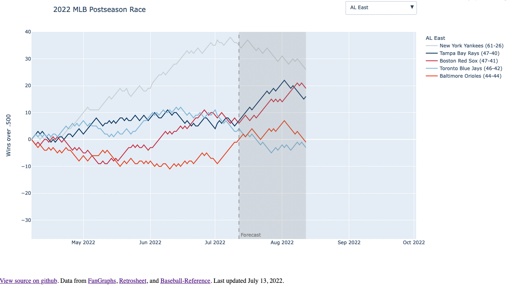

# An interactive dashboard for the MLB postseason race

I'm a big baseball fan! I thought a dashboard visualizing the postseason race would be a fun way to practice and deepen some of my programming and data visualization skills.

[Click here to see it in action!](https://dashboard-5odpqk6ypq-ue.a.run.app/)

I had a few basic goals for this project:
- Create and deploy an interactive dashboard with Dash and Plotly.
- Implement a pipeline for ingesting real world data.
- Learn to use github actions for CI/CD.

A few other things I've learned as a by-product:
- Ways to optimize Docker images for Cloud Run services.

I still have several future goals for this project (see the Projects tab):
- Implement CI.
- Create a Bayesian forcasting model.
