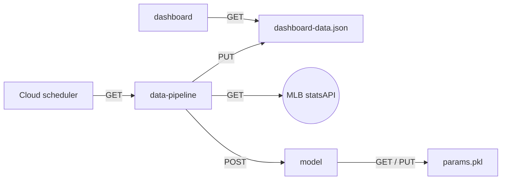

# An interactive dashboard for the MLB postseason race

I'm a big baseball fan so I made a dashboard for visualizing the MLB postseason race.

[Click here to see it in action!](https://dashboard-5odpqk6ypq-ue.a.run.app/)

## Architecture

The dashboard is a combination of three google Cloud Run services.
- `dashboard` serves the frontend dashboard. It loads a json file from a storage bucket.
- `data-pipeline` gets game results, processes the data, and updates the json file. It also calls the model API, trains the model, and incorporates a forecast into the dashboard data. It is triggered each morning by Cloud Scheduler.
- `model` is an API for forecasting. It has two methods: 
  - `train` uses game results to update the model. The model is trained in an online fashion.
  - `forecast` uses Monte Carlo simulation to predict results of upcoming games.

## Data

[Data sources](https://github.com/lanej5/mlb/blob/main/data.md)

## Modelling

I'm currently developing several forecasting models offline. Both are essentially state-space models with online learning algorithms. There are two flavours:
- Logistic regression with one-hot representation of team strength (this is essentially the ELO model) plus adjustments.
- A Bayesian version of the same model where team strengths are modelled by Gaussians (this is like glicko but without the approximations).

## DevOps

For this project I learned how to use Github Actions to continuously deploy each service. A new deployment of each service occurs each time code is pushed to the corresponding directory in the repo.  So far this has saved me a lot of time doing simple things so that I can focus on writing better code. See `.github/workflows` for the github action yaml files.

## Security

I've followed all the security best practices I'm aware of. Although you can see all the source code for the services in this project, you shouldn't be able to do anything malicious. This is because:
- The backend services (`data-pipeline`, `model`, and storage) require authentication.
- Github secrets are used to associate service accounts with services.
